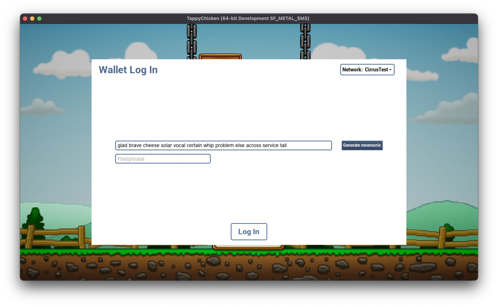

This is a demo project for the [Stratis Plugin for Unreal Engine](https://github.com/stratisproject/UnrealEnginePlugin).

It based on the well-known Unreal Engine game "Tappy Chicken" ([link](https://www.unrealengine.com/en-US/blog/shipping-tappy-chicken), [github](https://github.com/jiji4000/tappychicken)).

It uses a full power of Stratis Plugin, both in a C++ and Blueprint, to access wallet data and interact with NFT via [smart contracts](https://academy.stratisplatform.com/Operation%20Guides/SmartContracts/smartcontracts-introduction.html).

### How to play?

Start the game and you will see the game starter screen:

Here you can press **Play** button to start the game, or press **F7** on your keyboard to reveal a NFT functionallity of the game.

At first, you will see Login screen, and then you will have access to NFT Store&Inventory page.

You can purchase an item from the store by clicking on it:

You can equip owned item:

Eqipped item will be used as a skin for a playable character:

### How's it implemented?

This project utilizes two smart contracts: [NFT contract](https://github.com/stratisproject/CirrusSmartContracts/tree/master/Testnet/NonFungibleToken) and [NFTStore contract](https://github.com/stratisproject/CirrusSmartContracts/tree/master/Testnet/NFTStore/NFTStore).

In initial state, we have several minted NFTs ([see TokenURI](https://stratisnftmetadata.blob.core.windows.net/metadata/0305cb32-af2a-4b36-929c-36cf40391f5d.json)) with Base64-encoded URI attribute named 'texture'. Also we have deployed NFTStore contract which owns these NFTs.

To get information about owned items and items on sale, we are using `UStratisUnrealManager::getOwnedNFTs` method (which is a wrapper for a [/Unity3d/get-owned-nfts](https://api-sfn-test.stratisphere.com/Unity3d/get-owned-nfts?ownerAddress=tCnT3S9AQ3LCusEem914ShSbTK3KsewHRQ) API method).

To access NFT data, we are using `UNFTWrapper::getTokenURI` method with a custom metadata deserializer.

To perform NFT purchase, we are using `UStratisUnrealManager::sendCallContractTransaction` with "Buy" method name, and then we are waiting for a receipt using `UStratisUnrealManager::waitTillReceiptAvailable`.

### C++ part

We are using C++ for some minor features (like value conversion or clipboard access), as well for a JSON parsing.

`UAsyncTaskGetNFTInfo` is a wrapper class for NFT info fetching.

### Blueprints part

Blueprints for this project are located in **Content/Blueprints** directory.

 * `UI/` - this directory contains implementations of various UI windows and dialogs.
 * `Models/` - here we have data-objects and wrappers for them.
 * `BP_MainGame` - main blueprint, it contains almost everything about game & game rules. It implements NFTView interface.
 * `NFTController`, `NFTItemsFetcher` - core of NFT functionallity in this projects. They are used to login, load and buy NFTs, and also they control UI state.
 * `SkinController` - it contains code for applying NFT as a playable character skin.

If you have some questions left, please [join us on Discord](https://discord.com/invite/9tDyfZs)!